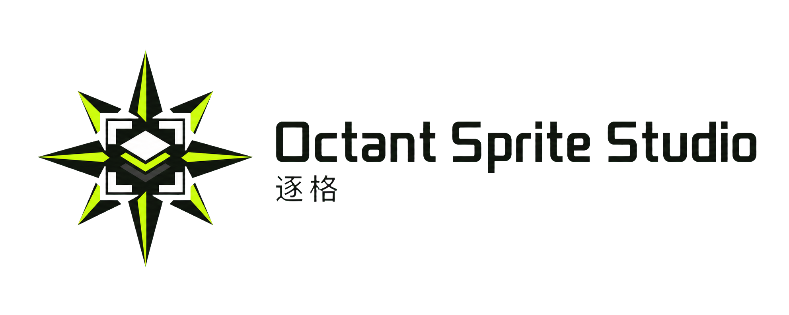
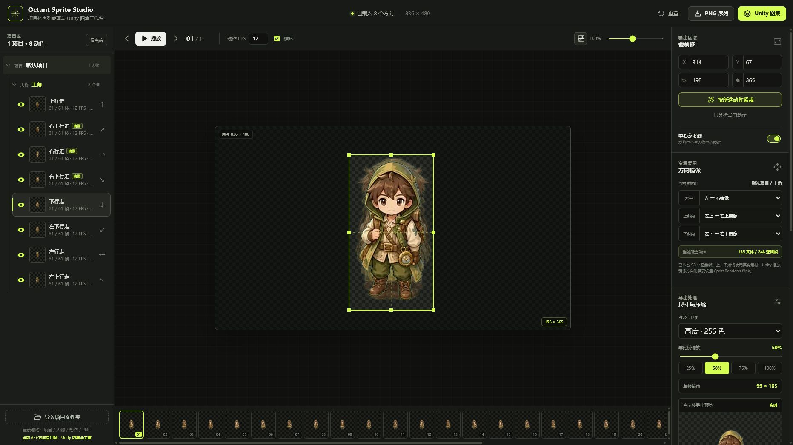

# Octant Sprite Studio

<picture>
  <source media="(prefers-color-scheme: dark)" srcset="./public/branding/octant-logo-light.png">
  <source media="(prefers-color-scheme: light)" srcset="./public/branding/octant-logo-dark.png">
  
</picture>

> 中文名：逐格

一个本地优先的多方向 PNG 序列帧工作台，用于管理人物动作、播放预览、裁剪留白、中心校准、非破坏性减帧、方向镜像、轻量动态修饰以及 Unity 图集导出。

## 运行界面



## 仓库信息

- **Repository**：`octant-sprite-studio`
- **Product**：Octant Sprite Studio
- **中文名**：逐格
- **Description**：A local-first directional sprite sequence editor for cropping, alignment, frame thinning, mirroring, per-action FPS, and Unity atlas export.

品牌资产位于 `public/branding/`，包含透明背景 App Icon，以及适配深色、浅色背景的横版 Logo。

## 功能

### 项目与动作管理

- 使用“项目 → 人物 → 动作”三级结构管理素材。
- 项目与人物支持折叠和重命名。
- 不同项目、人物中的同名动作彼此独立。
- 每个动作可单独设置 FPS、位置偏移和叠加透明度。
- 多个动作可同时显示，用半透明叠加方式校正人物中心。
- 右侧检查器收敛为“常规”和“动态”两个停靠面板；裁剪、对齐、镜像、导出与减帧集中在常规面板中。
- 两个面板可拖拽合并为标签，或停靠到目标面板的上、下、左、右。
- 支持拖动分割条与右侧边界调整尺寸，并自动保存当前工作区布局。

### 序列编辑

- 播放、暂停、逐帧切换与循环预览。
- 播放时自动使用当前动作的独立 FPS。
- 拖动裁剪框或输入 X、Y、宽、高，移除人物两侧的多余空白。
- 根据透明像素分析人物边界，并忽略孤立杂点。
- 按当前帧的人物中心和脚底自动对齐动作。
- 每隔 N 帧移除一帧，可重复执行并随时恢复原始帧。

所有减帧、裁剪和校准操作均为非破坏性处理，不会删除或修改磁盘上的原始 PNG。

### 方向镜像

- 缺少左/右、左上/右上或左下/右下动作时，可自动水平镜像补齐。
- 即使左右素材都存在，也能主动选择一侧作为镜像源，以减少图集体积。
- 上、下方向不会互相镜像。
- Unity 图集只写入实体纹理帧，镜像动作通过 `flipX` 配置复用已有区域。

### 轻量动态修饰

- 为每个动作独立设置水平/垂直摆动、旋转、呼吸缩放、周期和起始相位。
- 内置左右漂移、上下浮动、轻微摇摆、呼吸缩放四种预设。
- 动态以正弦曲线围绕 Sprite 底部中心点播放，与序列帧共用播放控制。
- 动态不会烘焙进 PNG；Unity 图集额外导出 `character_walk.motion.json`，并在 `.tpsheet` 中写入 `# motion` 元数据。

### 导出

- 将所选动作导出为裁剪后的 PNG 序列 ZIP。
- PNG 序列按“项目 / 人物 / 动作”目录保存，并附带 `crop.json`。
- 将多个动作合并为一张透明 PNG 图集和一份 `.tpsheet` 配置。
- 支持 25%～100% 等比例缩放。
- 支持无损、轻度、中度、高度四档 PNG 压缩。
- 实时预览缩放、压缩效果和单帧体积。
- 每个动作的独立 FPS、项目归属和镜像关系都会写入导出配置。

## 快速开始

需要 Node.js 20 或更高版本。

```bash
npm install
npm run dev
```

浏览器打开：

```text
http://127.0.0.1:5173/
```

生产构建：

```bash
npm run build
npm run preview
```

## 素材目录

点击“导入项目文件夹”，选择符合以下结构的目录：

```text
我的项目/
├─ 勇者/
│  ├─ 上行走/
│  │  ├─ 上行走_001.png
│  │  └─ 上行走_002.png
│  ├─ 下行走/
│  ├─ 左行走/
│  └─ 右行走/
└─ 法师/
   ├─ 上行走/
   ├─ 下行走/
   └─ 左行走/
```

标准路径为：

```text
项目 / 人物 / 动作 / PNG
```

帧文件会按文件名末尾的数字自然排序。缺少可镜像的水平方向时，编辑器会在对应人物内补齐，不会跨人物复用素材。

## 使用流程

1. 导入项目文件夹。
2. 在左侧选择人物和动作。
3. 设置动作 FPS，并播放检查节奏。
4. 调整公共裁剪框，去除多余透明区域。
5. 叠加多个动作，校准人物中心和脚底。
6. 按需减帧、缩放、压缩或设置方向镜像。
7. 选择要导出的动作。
8. 导出 PNG 序列或 Unity 图集。

## Unity 图集格式

点击“Unity 图集”后会得到一个 ZIP，主要包含：

```text
character_walk.png
character_walk.tpsheet
character_walk.motion.json
```

`.tpsheet` 使用 TexturePacker 风格的文本切片格式，并扩展了项目、动作 FPS 和镜像元数据：

```text
:format=40300
:texture=character_walk.png
:size=2048x2048
:fps=12
:action-fps=down;12
:action-fps=left;8
# action;down;默认项目;主角;下行走;fps=12
# action;left;默认项目;主角;左行走;fps=8
# mirror;right;left;flipX=true
# motion;down;x=12;y=0;rotation=0;scale=0;duration=3.2;phase=0;wave=sine;pivot=0.5,0
down_001;2;2;99;183;0.5;0
left_001;105;2;99;183;0.5;0
```

字段说明：

- `:fps`：兼容旧解析逻辑的默认帧率。
- `:action-fps=动作ID;帧率`：动作独立 FPS，Unity 解析时应优先使用。
- `# action`：动作 ID、项目名、人物名、动作名和 FPS。
- `# mirror`：目标动作、源动作和水平翻转标记。
- `# motion`：运行时位移、旋转、缩放、周期、相位、波形和 Pivot；位移单位为缩放后的输出像素。
- 普通帧行：名称、X、Y、宽、高、Pivot X、Pivot Y。

该文件用于自定义 Unity 解析库。官方 TexturePacker Importer 可能会校验文件来源并拒绝手写 `.tpsheet`，因此不要依赖官方插件直接导入。

图集内 Sprite 的 pivot 为底部中心 `(0.5, 0)`。如果图集超过 Unity 默认纹理尺寸，请提高 Texture Import Settings 中的 `Max Size`，或在导出前降低缩放比例。

## 快捷键

| 快捷键 | 操作 |
| --- | --- |
| `Space` | 播放或暂停 |
| `←` / `→` | 上一帧 / 下一帧 |
| `Shift` + 方向键 | 微调当前动作位置 |

## 技术栈

- Vue 3
- Vite
- JSZip
- UPNG.js
- Phosphor Icons
- Canvas 2D

## 本地数据

- 导入的本地图片通过浏览器临时对象地址读取，不会上传到服务器。
- 内置素材的裁剪、偏移、镜像、减帧和 FPS 设置保存在浏览器 `localStorage`。
- PNG 序列和 Unity 图集使用编辑器当前帧列表导出。
- 发布仓库前，请自行确认示例人物素材的版权和分发权限。
